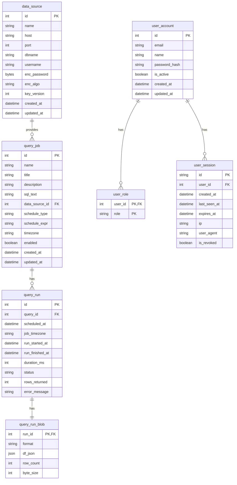
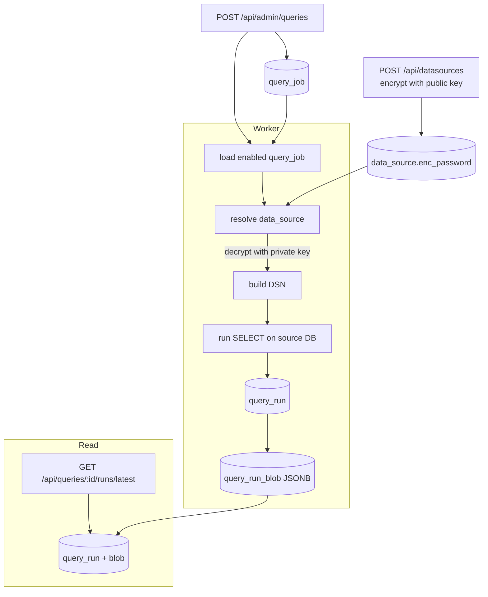
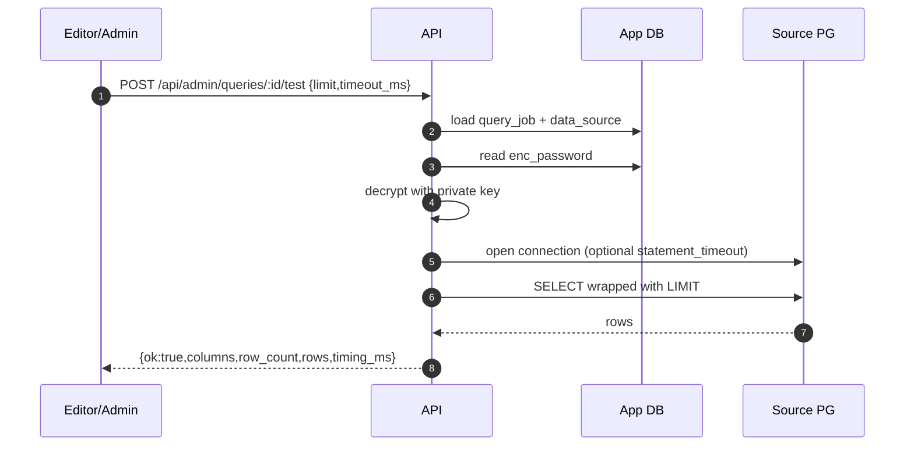
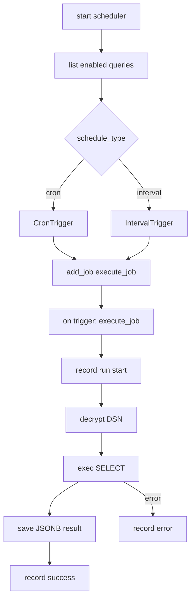
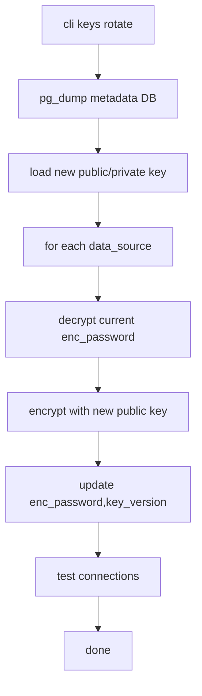
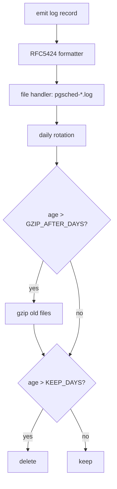
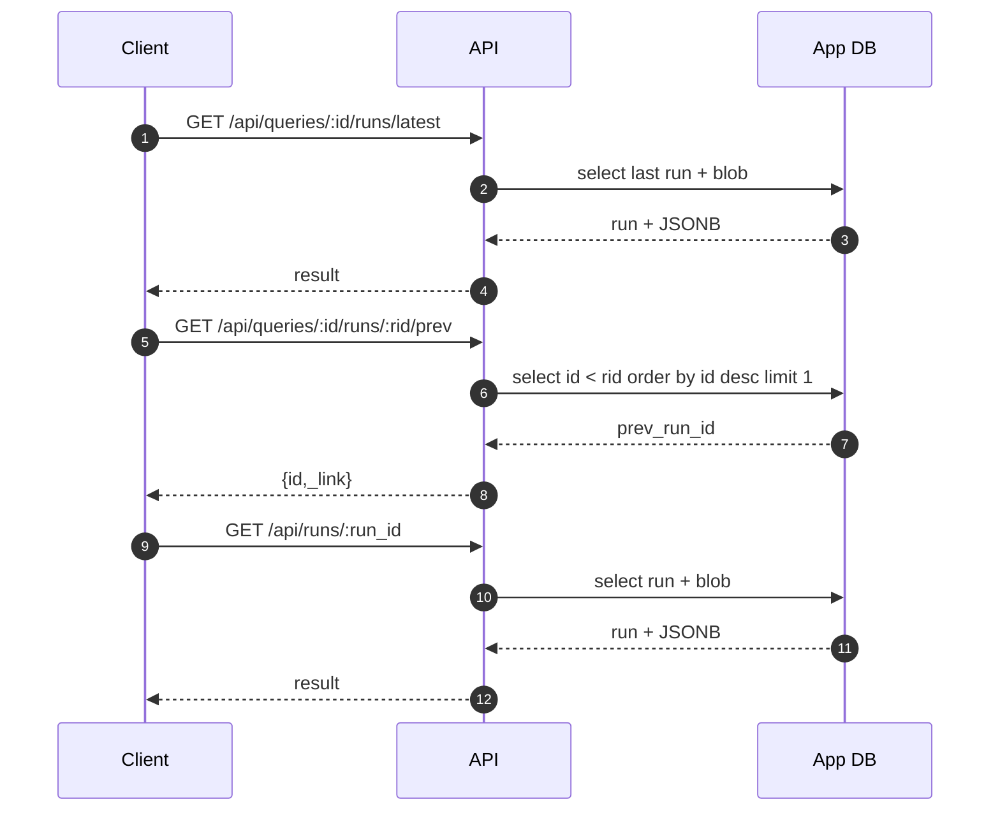

# pg-sched — scheduled Postgres query runner + JSONB results API

pg-sched is a compact platform to **schedule SQL queries**, **store every run’s results**, and **serve them via a JSON API** for dashboards.

- Flask API (users/auth, data sources, queries CRUD, run browsing)
- Worker (APScheduler; cron/interval per query)
- Click CLI (keys, users, data sources, queries)
- RFC5424-style local logging with rotation, gzip, retention
- Passwords for external Postgres sources encrypted via **NaCl sealed boxes**

---

## Architecture (high level)

```mermaid
flowchart TD
  subgraph API["Flask API"]
    U[Users & Sessions]\n(bp_users.py)
    DS[Data Sources]\n(bp_conn.py)
    QCRUD[Queries CRUD]\n(bp_queries.py)
    RR[Runs & Results]\n(api.py)
  end

  subgraph Worker["Worker"]
    SCHED[APScheduler]
    EXEC[Query Executor]
  end

  subgraph AppDB["Postgres (App metadata)"]
    T1[(user_*)]
    T2[(data_source)]
    T3[(query_job)]
    T4[(query_run, query_run_blob)]
  end

  subgraph Src["External Postgres Sources"]
    PG1[(analytics)]
    PG2[(warehouse)]
  end

  API -->|SQLAlchemy| AppDB
  Worker -->|SQLAlchemy| AppDB
  EXEC -->|SELECT| Src
  QCRUD --> RR
  SCHED --> EXEC
```

---

## ER diagram



---

## Flows

### 1) Login → Session → AuthZ

```mermaid
sequenceDiagram
  autonumber
  participant C as Client
  participant A as API (Flask)
  participant DB as App DB

  C->>A: POST /api/auth/login {email,password}
  A->>DB: SELECT user by email
  DB-->>A: user row + password_hash
  A-->>C: Set-Cookie: sid; {ok,user,roles}

  Note over C,A: Subsequent calls reuse sid cookie

  C->>A: GET /api/users/me
  A->>DB: validate session by sid
  DB-->>A: session + user + roles
  A-->>C: {authenticated:true,user,roles}

  C->>A: GET /api/admin/queries
  A->>DB: check role editor/admin
  DB-->>A: ok
  A-->>C: items...
```

### 2) Admin creates Data Source and Query → Worker executes → Dashboard reads latest



### 3) Dry-run (no persistence)



### 4) APScheduler scheduling and execution



### 5) Key rotation via CLI



### 6) RFC-style logging with rotation/gzip/retention



### 7) Run history navigation



---

## Notes for GitHub Mermaid

- Use triple backticks with the word `mermaid` right after, like:
  \`\`\`mermaid
  ...diagram...
  \`\`\`
- Stick to simple types/keywords (e.g., `int`, `string`, `boolean`, `datetime`, `json`) in ERD.
- Avoid quotes or extra comments inside ER blocks.
- For flowcharts, use `flowchart TD` or `flowchart LR`. For sequences, use `sequenceDiagram`.

