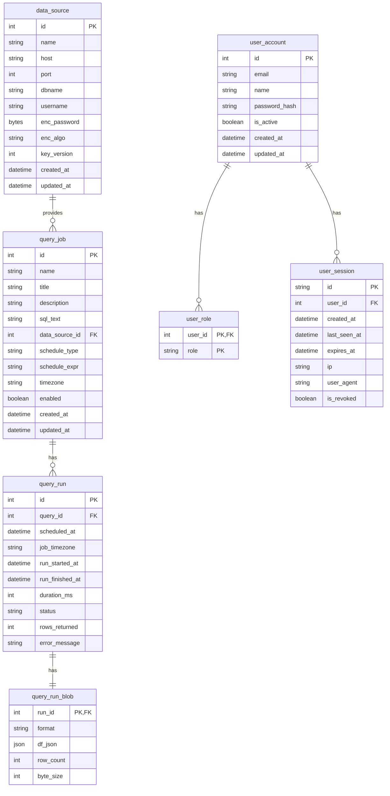

# pg-sched — scheduled Postgres query runner + JSONB results API

pg-sched is a compact platform to **schedule SQL queries**, **store every run’s results**, and **serve them via a JSON API** for dashboards. It includes:

- **Flask API** (read endpoints + admin CRUD via blueprints)  
- **Worker** (APScheduler; cron/interval per query)  
- **Click CLI** (keys, users, data sources, queries)  
- **RFC5424-style local logging** with rotation, gzip, retention

---

## Features

- Store queries with title, description, SQL, schedule (cron/interval), timezone, and enabled flag.
- Execute against external Postgres sources; **passwords are encrypted** via **libsodium sealed boxes**.
- Persist each run with timing, status, row count, and **results in JSONB** (Pandas `orient='table'`).
- API to fetch latest run, page through run history, filter by time, or dry-run a query safely.
- Local RFC-style logs with daily rotation, gzip after N days, retention.

---

## Architecture

```
               +-------------------+
               |   Postgres (App)  |  <-- users, roles, data_sources,
               |  "metadata DB"    |      query_job, query_run, query_run_blob
               +---------+---------+
                         ^
                         | SQLAlchemy Engine (cfg().engine)
+------------------------+-------------------------+
|                       App                        |
|                                                  |
|  Flask API (api.py)                              |
|  - Session cookie (sid), CORS, ProxyFix          |
|  - Blueprints:                                   |
|     /api (users & auth)                          |
|     /api/datasources (admin)                     |
|     /api/admin/queries (CRUD + dry-run)          |
|     /api/queries/<qid>/runs... (public read)     |
|  - RFC5424-like file logging (local logs/)       |
+------------------------+-------------------------+
                         |
                         v
+--------------------------------------------------+
|   Worker (worker.py)                             |
|   - Reads enabled query_job rows                 |
|   - APScheduler: cron/interval per query         |
|   - Decrypts DSN via libsodium private key       |
|   - Runs SELECT, saves results to JSONB          |
|   - RFC5424-like file logging                    |
+--------------------------------------------------+
                         |
                         v
               +-------------------+
               | Postgres Sources  |  <-- external read-only DBs
               +-------------------+
```

---

## ER diagram (Mermaid)



---

## Security model

- External DSN passwords stored as **libsodium sealed-box ciphertext** in `data_source.enc_password`.
  - Encrypt with **public** key (`PUBLIC_KEY_B64_PATH`)
  - Decrypt with **private** key (`APP_PRIVATE_KEY_B64_PATH`) in API/worker
- Users & roles (`viewer`, `editor`, `admin`) with session auth (cookie `sid`).
- Password hashing: **Argon2id** + app-wide **pepper** (`ARGON2_SECRET_KEY_B64`) + per-hash random salt.
- Logs redact keys in `REDACT_KEYS`; payloads truncated to `MAX_LOG_BYTES`.
- **SELECT-only** enforced for queries (API & worker).

### Why NaCl Sealed Boxes

- **Asymmetric**: encrypt anywhere with public key; only server (private key) can decrypt.  
- **Misuse-resistant**: safe defaults (Curve25519 + XSalsa20-Poly1305), ephemeral keys, authenticated.  
- **Operationally simple**: DB dumps are safe; key rotation supported by CLI; plaintext never logged.

---

## Configuration

All settings come from environment variables (you can use `.env`).  

| Variable | Default | Purpose |
|---|---|---|
| `PG_DSN_APP` | — | Metadata DB DSN (SQLAlchemy) |
| `PUBLIC_KEY_B64_PATH` | `./public_key.base64` | Path to libsodium public key (encrypt) |
| `APP_PRIVATE_KEY_B64_PATH` | — | Path to libsodium private key (decrypt) |
| `ARGON2_SECRET_KEY_B64` | — | Base64 32–64 bytes; Argon2 pepper |
| `SESSION_TTL_HOURS` | `72` | Session lifetime |
| `SESSION_EXTEND_ON_USE_MIN` | `60` | Auto-extend window (minutes) |
| `ALLOWED_ROLES` | `viewer,editor,admin` | Allowed roles |
| `DEFAULT_QUERY_INTERVAL` | `21600` | Fallback interval (seconds) |
| `APP_NAME` | `pgsched-api` | Log app name |
| `LOG_DIR` | `./logs` | Directory for logs |
| `RFC_ENTERPRISE_ID` | `32473` | RFC5424 SD-ID enterprise ID |
| `ROTATE_UTC` | `1` | Rotate at UTC midnight |
| `GZIP_AFTER_DAYS` | `7` | Gzip rotated logs after N days |
| `KEEP_DAYS` | `200` | Retain logs (days) |
| `MAX_LOG_BYTES` | `4096` | Max bytes of payload in logs |
| `REDACT_KEYS` | `password,new_password,current_password,token,authorization,secret` | Keys to mask in logs |
| `TRUST_PROXY` | `1` | Enable **ProxyFix** to trust `X-Forwarded-*` headers |
| `CORS_ALLOWED_ORIGINS` | `*` | Comma-separated allowed origins |

**`TRUST_PROXY` note:** Enable (`1`) only when running behind a **trusted reverse proxy** (NGINX/HAProxy/ALB) that sets/strips `X-Forwarded-*`. If the app is public-facing directly, set to `0` to avoid header spoofing.

---

## API overview

### Users & Auth (`/api`)
- `POST /auth/login` → `{email, password}` → sets `sid` cookie  
- `POST /auth/logout`  
- `GET /users/me`  
- `GET /users` (admin)  
- `POST /users` (admin) → `{email, name, password, roles[]}`  
- `GET /users/<uid>` (admin)  
- `PATCH /users/<uid>` (self/admin; roles admin-only)  
- `DELETE /users/<uid>` (admin)  
- `POST /users/<uid>/password` (self/admin) → `{new_password, current_password?}`

### Data Sources (`/api/datasources`, admin)
- `GET /` list  
- `POST /` → `{name, host, port?, dbname, username, password? | enc_password_b64?, key_version?}`  
- `GET /<dsid>`  
- `PATCH /<dsid>` (same fields; supports password rotate)  
- `DELETE /<dsid>?force=1`  
- `POST /<dsid>/test` (decrypt + `SELECT 1`)

### Queries CRUD (`/api/admin/queries`, editor/admin)
- `GET /` list (`q`, `enabled`, `limit`, `offset`)  
- `POST /` → `{name, title, description?, sql_text, data_source_id|data_source, schedule_type, schedule_expr, timezone?, enabled?}`  
- `GET /<qid>`  
- `PATCH /<qid>` (same fields; SELECT-only)  
- `DELETE /<qid>?force=1`  
- `POST /<qid>/test` dry-run (no persistence) → `{limit?, timeout_ms?}`

### Runs & Results (`/api`)
- `GET /queries/<qid>/runs` (pagination + `start`, `end`, `before`, `after`, `limit`)  
- `GET /queries/<qid>/runs/latest`  
- `GET /runs/<run_id>`  
- `GET /queries/<qid>/runs/<run_id>/prev`  
- `GET /queries/<qid>/runs/<run_id>/next`

---

## Quickstart

```bash
python -m venv .venv
. .venv/bin/activate
pip install -r requirements.txt

cp .env.example .env    # edit with your settings
psql "$PG_DSN_APP" -f schema.sql
```

**Keys:**
```bash
python cli.py keys gen --public ./public_key.base64 --private ./private_key.base64
```

**Admin user:**
```bash
python cli.py users add --email admin@example.com --name "Admin" --roles admin --password 'StrongPW!'
```

**Add data source:**
```bash
python cli.py dsn add --name analytics_ro --host db.example.com --port 5432   --dbname analytics --username readonly --password 's3cret' --key-version 1
```

**Add query (6-hour interval):**
```bash
python cli.py queries add   --name orders_last_24h   --title "Orders (24h)"   --sql "SELECT created_at AS ts, id, amount FROM orders WHERE created_at > now() - interval '24 hours';"   --data-source analytics_ro   --schedule-type interval --schedule-expr PT6H   --timezone UTC --enabled
```

**Run services:**
```bash
python api.py      # Flask API
python worker.py   # Scheduler/runner
```

---

## Tips

- Use `POST /api/admin/queries/<qid>/test` to validate SQL and latency **without** persisting results.  
- Typical result sets (<~150 rows) are perfect for JSONB storage.  
- For dashboards:  
  - `GET /api/queries/<qid>/runs/latest` for newest, or  
  - `GET /api/queries/<qid>/runs?start=...&end=...` to browse history.

---

## Roadmap

- OpenAPI/Swagger spec


- Row-level permissions  
- CSV/Parquet export next to JSONB  
- Result size guardrails & sampling
